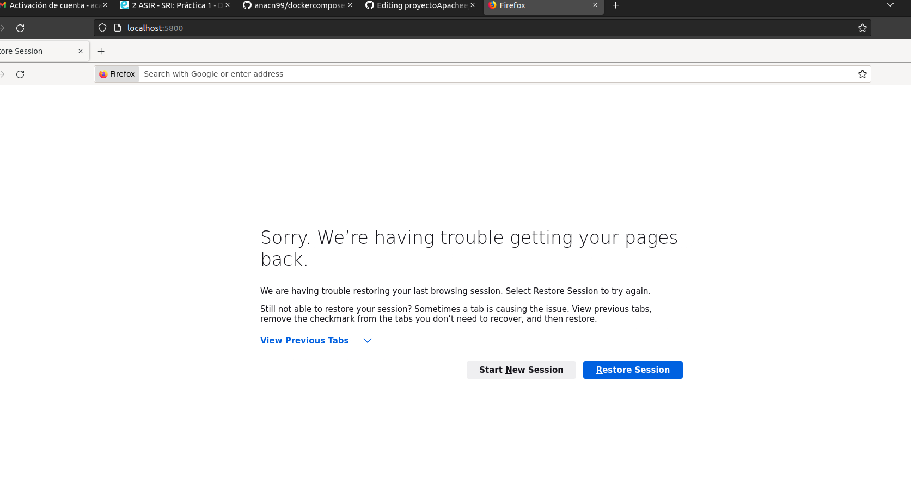
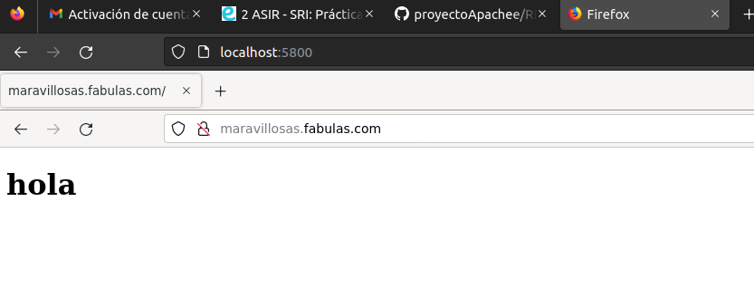
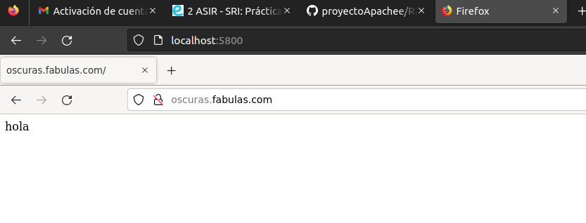

 # Instalación de Apache+Virtual Host

 ### Docker-compose.yml:
 - Empezamos configurando el docker-compose.yml que ya teníamos hecho de la práctica anterior:
   - Añadimos el contenedior par ael cliente, que es asir_bind9, le configuramos la redy los volumenes los mapeamos a  las carpetas de zonas y configuración.
 - Añadimos otro contenedor para Firefox, modificamos sus puertos, le añadimos una IP y configuramos su volumen, además le añadimos el DNS (configurada la IP con el apartado anterior).
 - Ponemos la red en external:true.

 Aquí vemos que podemos hacer a Firefox con el localhost en el puerto 5800
 
 
 
 ### ConfApache
  - En la carpeta de sites modificamos los puertos del Virtualhost para que escuchen al puerto 80 (tenemos que hacer que el servidor de asi-apache también esté mapeando este puerto ) 
  - Además le añadimos el ServerName con los nombres de los domimnios dirigido cada dominio a cada sitio.
  - En ports.conf hacemos que escuhe al puerto 80 también.
  
 ### ConfDNS
 
  - Aquí tenemos los archivos de named.conf, named.conf.local y named.conf.options
  - Modificamos named.conf.local para que la zone sea de fabulas.com. y que el archivo nos dirija también a la zona
  - Esta es la única modificación que necesitamos realizar aquí.
 
 ### Html
 
  - Aquí tenemos los 2 sitios, con sus respectivos index.html/.php, que son los que se mostraran al dirigirnos a cada dominio
 
 ### Zonas
  - Aquí tenemos el db.fabulas.com, en este archivo le estamos diciendo 
  
  - CNAME sirve para definir un alias para el nombre canónico. Es decir, aquí hacemos el alias de oscuras para el nombre canónico que es maravillosas.
  - El nombre maravillosas lo tenemos asignado a la IP del servidor, que está referenciando al DNS.
  - Con esto bien configurado al entrar en Firefox ya nos deja buscar los dominios

 # El DNS tien que resolver dos dominios a la ip del apache:

    maravillosas.fabulas.com
    oscuras.fabulas.com
  - Aquí tenemos un dominio resuelto: 
  
 
 
  -  Aquí tenemos el otro dominio también resuelto
  
 

